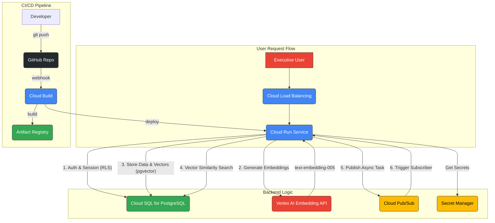

# Custom Executive Prototype Architecture

## Overview

- **Compute Target:** Cloud Run
- **Session Store:** Cloud SQL for PostgreSQL
- **Vector Memory:** Cloud SQL for PostgreSQL with pgvector
- **Git Provider:** GITHUB

## Components

- **Cloud Run**
- **Cloud SQL for PostgreSQL**
- **Cloud Pub/Sub**
- **Vertex AI Embedding API**
- **Cloud Load Balancing**
- **Cloud Build**
- **Artifact Registry**
- **Secret Manager**
- **GitHub**

## Topology Diagram

---
*Generated autonomously by the Enterprise Fleet (ArchitectAgent).*
